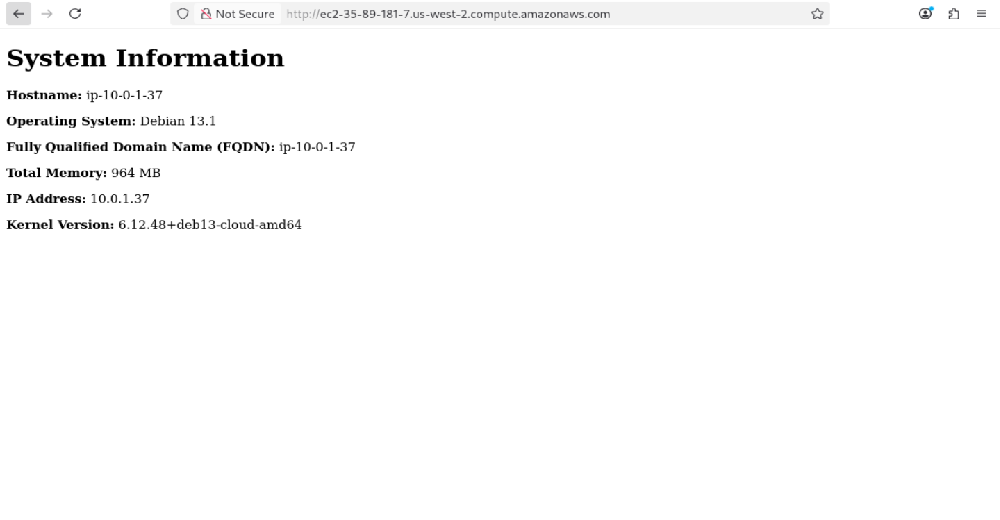

# lab-week5-ansible

## Required commands:

## Create new keys:

```bash
# This command would create a key named "aws" in ~/.ssh folder
ssh-keygen -t rsa -b 4096 -f ~/.ssh/aws
```


## Run included scripts to import and delete keys:

```bash
# To run import script and upload public key (aws.pub)
./import_lab_key /home/fsokic/.ssh/aws.pub
# To run delete script and remove the public key when no longer needed
./delete_lab_key
```

## Terraform commands:

```bash
# Initializes the working directory and downloads necessary providers
terraform init

# Formats terraform configuration files to maintain consistent style
terraform fmt

# Checks if configuration syntax is valid
terraform validate

# Creates infrastructure based on configuration
terraform apply

# Destroys all infrastructure managed by terraform
terraform destroy
```

## Ansible commands:

```bash
# Checks the playbook for syntax errors without running any tasks
ansible-playbook --syntax-check playbook.yml

# Analyzes the playbook for best practices and common mistakes and ensuring clean code
ansible-lint playbook.yml

# Runs the playbook on the target hosts
ansible-playbook playbook.yml
```


